## 3DCGA Assignment 2

Group 30

#### Workload distribution

- **Renyi Yang** 5470668: Normal mapping, Environment mapping, Smooth paths, Hierarchical transformations, Move at constant speed along a Bézier curve[extra]. All 100%.
- **Thomas Verwaal** 5186595: Multiple viewpoints, PBR shader, Material textures. All 100%.

#### Multiple viewpoints
We have added two viewpoints in for each scene, you can change between viewpoints using the 1 and 2 keys. For the SolarSystem scene the second viewpoint follows the rotation of mars at a distance. The distance from which the second camera views mars can be adjusted and the camrea can also be rotated around the x, y and z axis of mars. We have also added the option to pause the SolaSystem scene, this feature is not perfect but was usefull for making screenshots. It is hard to show that our camera follows mars with screenshots but nonetheless here are a few screenshots of our different viewpoints. For the first screenshot we moved the default camera to give a top view, the second and third image are a screenshot from the position of the second viewpoint at two different moments.

  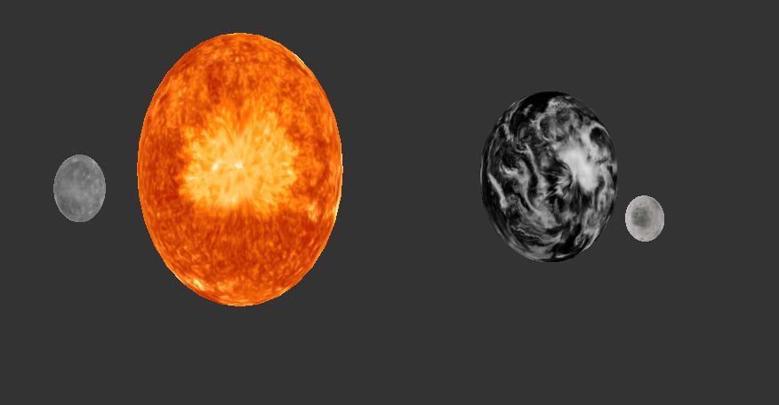

  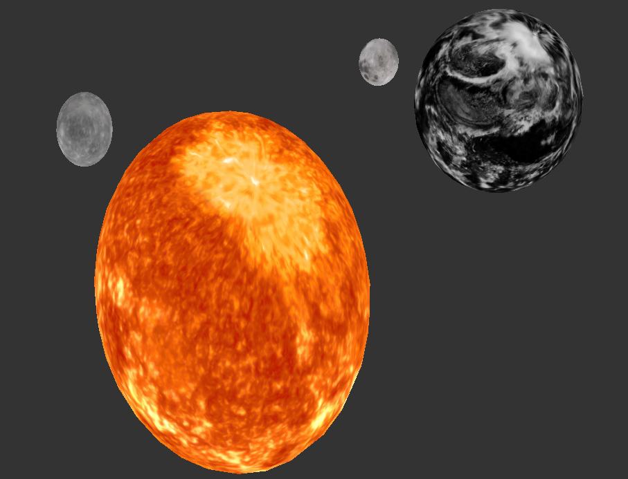
  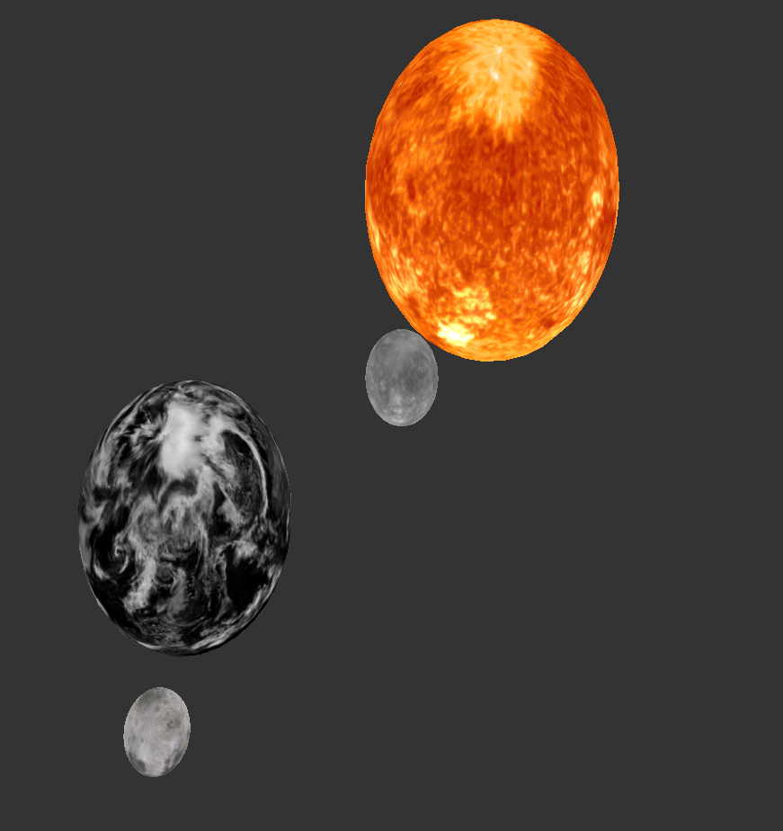

#### PBR Shader
We implemented our PBR shader by following two tutorials from LearnOpenGL:
https://learnopengl.com/PBR/Theory
https://learnopengl.com/PBR/Lighting

While these tutorials offer complete code examples, we (I, Thomas) aimed to implement the shader from scratch without directly copying the code. For full transparency here’s how I tried to implement the shading without looking at the code:
First I scanned through the tutorials to see what its about and to get a general understanding of the PBR shading. I then focused on the first tutorial, which explains the various components of the BRDF. I implemented each part of the BRDF by looking at the text explanation and not looking at the code. The code was always provided after the explanation, making it possible to understand the theory first. After implementing the different parts of BRDF I went to the second tutorial, which covers the entire implementation of the rendering equation. The other parts of the rendering equation (not BRDF) were already quite clear for me so I did a quick scroll through the second tutorial and implemented most of the shader without looking at the tutorial. There were a few things I didn’t directly understand at first, so I had to look at the code examples. These things were: The value of the fresnel constant and how to incorporate the metallic factor, the ambient occlusion value used (0.03) and the gamma correction part. For these parts, I used the following code snippets from the tutorial. I have added the source in comments above these code parts:
vec3 F0 = vec3(0.04); 
F0 = mix(F0, albedo, metallic);
vec3 ambient = vec3(0.03) * albedo * ao;
color = color / (color + vec3(1.0));
color = pow(color, vec3(1.0/2.2)); 

Now to show how the PBR shader works I downloaded a fish.obj from https://free3d.com/3d-model/fish-v1--996288.html.
The following screenshots show the effect of the PBR shader with different values for metallic and roughness.

  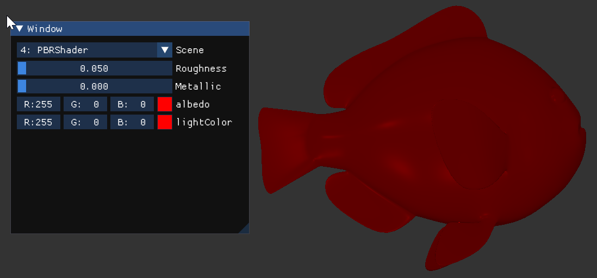
  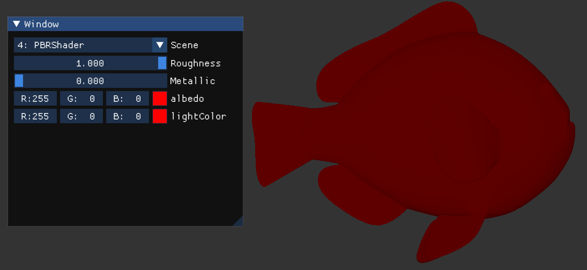

  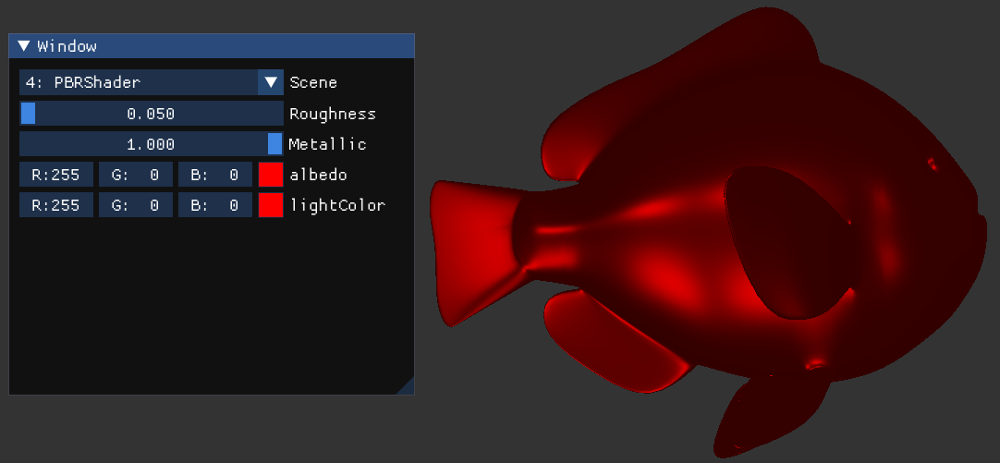
  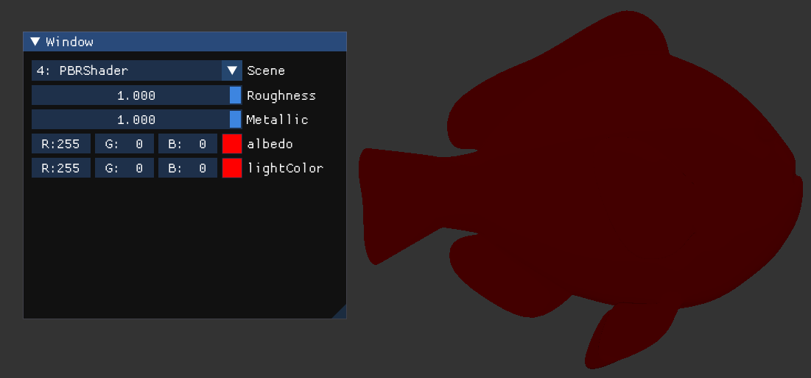

#### Normal mapping

Texture and material resource is from: https://www.textures.com/download/free-3d-scanned-stone-wall-2x2-3x3-4x4-meters/133264

We load a texture that stores the normal information of each fragment, this information is in tangent space, to translate it to the world space, we calculate the tangent and the bitangent for each vertex when preprocessing the mesh. In the vertex shader, we calculate the transformation matrix as `BVN = mat3(tangent, bitangent, normal)`, in fragment shader, we get the normal in the normal texture, transform it to world space using BVN, and use this normal in phong shading. By using normal mapping the surface is more uneven and has more detail.

  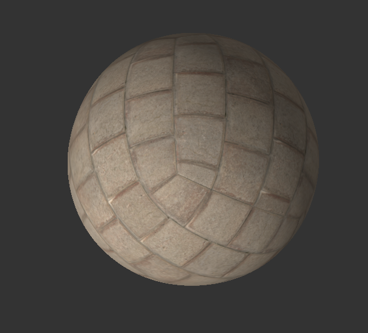
  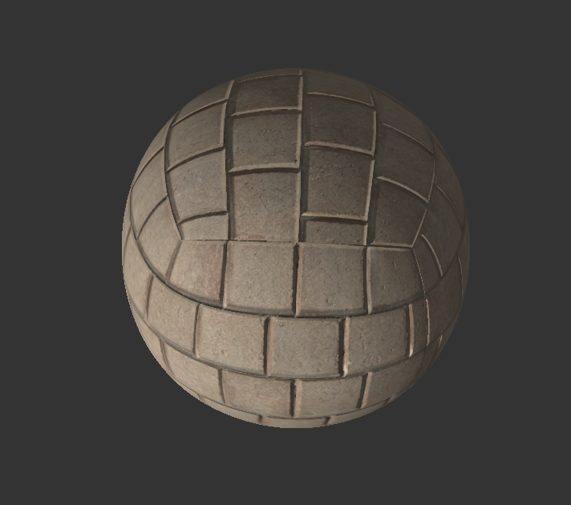

Texture only(left) and normal mapping(right)

#### Environment mapping

We prepare six textures in [+x, -x, +y, -y, +z, -z] axis representing the environment from all the directions.  We combine them into a `GL_TEXTURE_CUBE_MAP`. In the fragment shader, we query the texture by the opposite direction of the view direction according to the normal. By using environment mapping we simulate a reflective surface,

  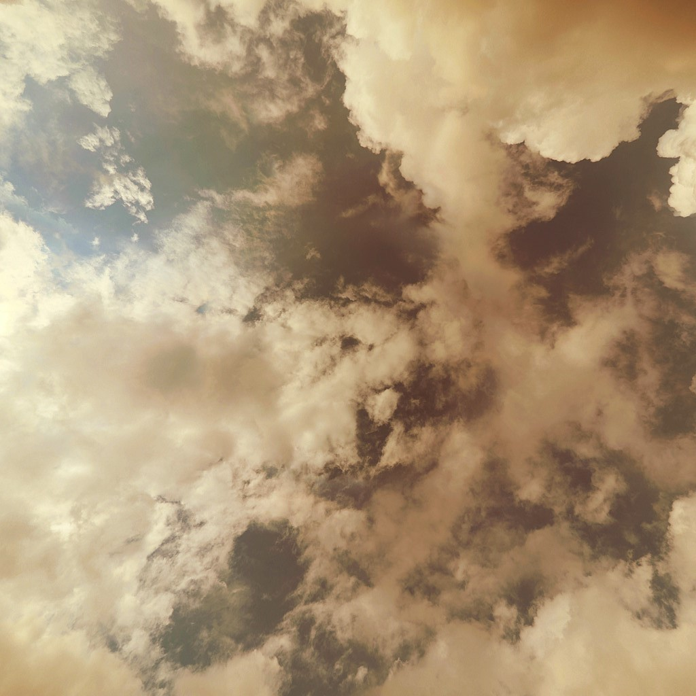
  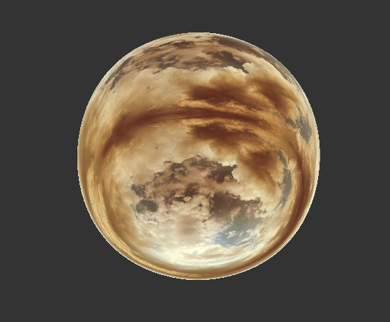

Environment Texture (left) and Environment mapping(right)

Environment texture is from: https://github.com/Well-Jing/3D-version-Gaunlet/tree/main/Release/skybox_darksky

#### Material textures
Textures are from: https://www.textures.com/download/free-3d-scanned-stone-wall-2x2-3x3-4x4-meters/133264 and https://www.textures.com/download/sci-fi-panel-pbr0331/137280.

Aside from the normal mapping and environment mapping we also added roughness, ambient occlusion and metallic textures. We use the values stored in these textures as inputs for our PBR shader. In our application we combined the PBR shader with the material textures, you can toggle the different textures in the menu. The roughness and metallic textures can only be toggled when the PBR shader is on since these values don't belong to our basic shading (Phong). Below we provide some screenshots of different combinations of our material textures, there are quite a few more combinations possible so launch the applicaton if you want to see more possiblities.

  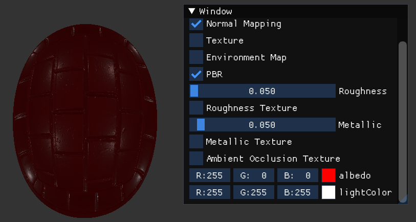
  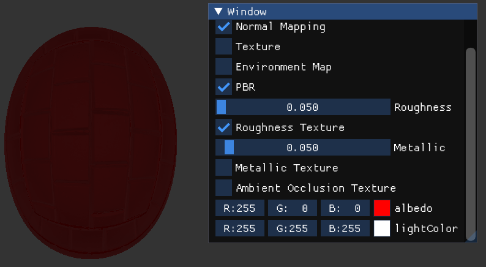

  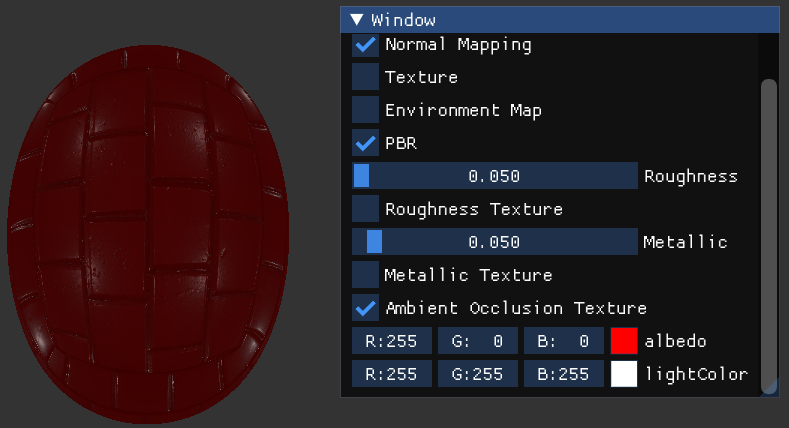
  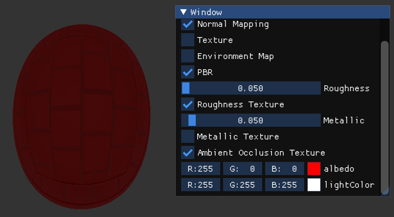

  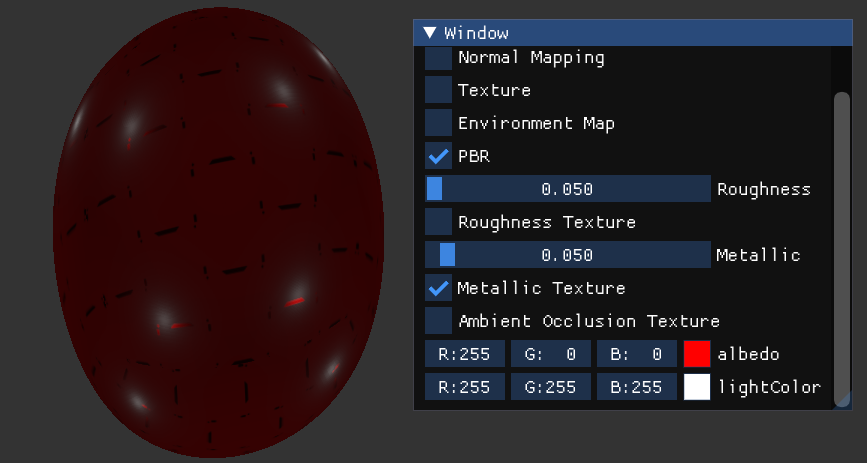
  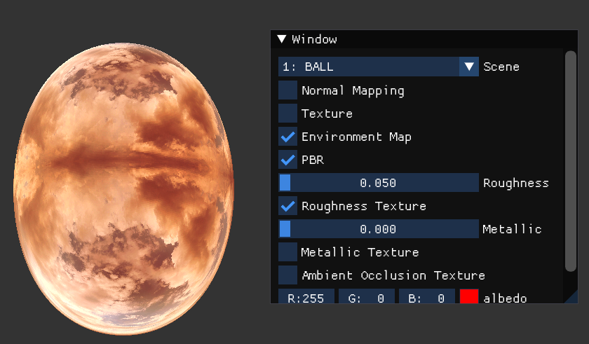

  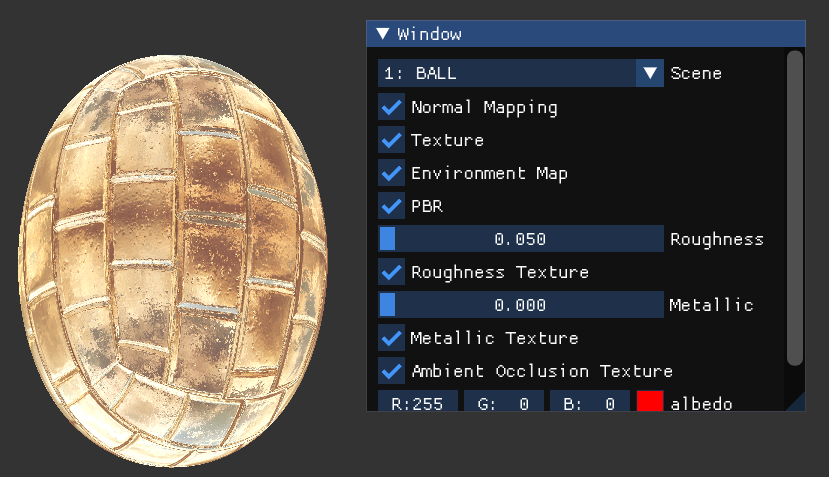

#### Smooth paths

We simulate bullet trajectory using cubic Bézier curves. a Bézier curve is defined by 
$$
\mathbf{B}(t) = (1 - t)^3 \mathbf{P}_0 + 3 (1 - t)^2 t \mathbf{P}_1 + 3 (1 - t) t^2 \mathbf{P}_2 + t^3 \mathbf{P}_3, \quad 0 \leq t \leq 1.

$$
We use the bullet emitter's position as p0, and target's position as p3, p1 and p2 are randomly sampled points from the same quadrant and within the emitter and the target.

We generate 100 points according to the above equation and utilize `GL_LINE_STRIP` to draw.

  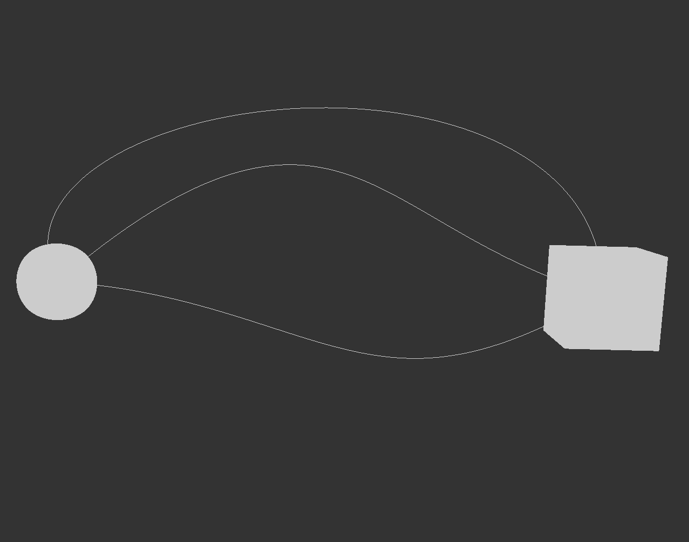
  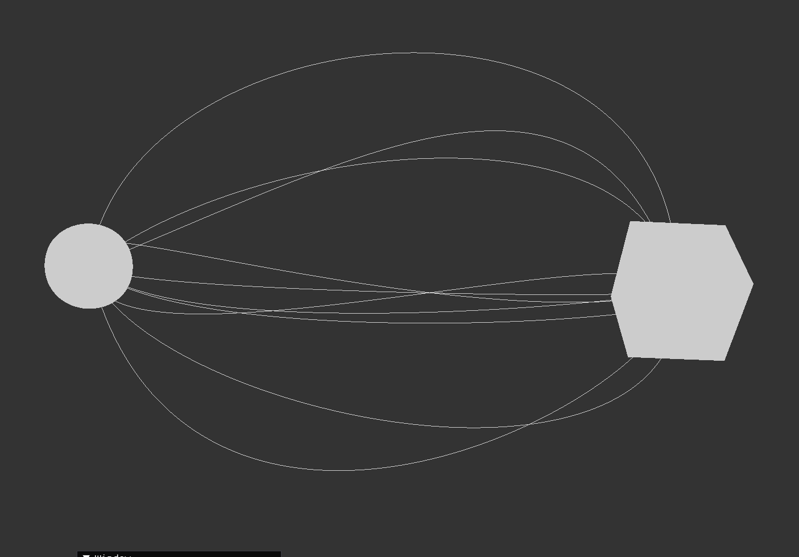

3 trajectory (left) and 10 trajectory(right)

#### Hierarchical transformations

We simulate a (part of) solar system by having mercury and the Earth revolve around the Sun, the Moon revolves around the Earth, and different planets have different revolution and rotation speeds.

We store the infomation of each planet in the array, and this infomation contains the index of the orbiting object in the array (sun is -1). We do deep first search on the array and multiply current translation matrix on predecessor's matrix to obtain the final transaction. The final modelmatrix is `transation * scale(self_radius) * rotation(revolution_radius)`

  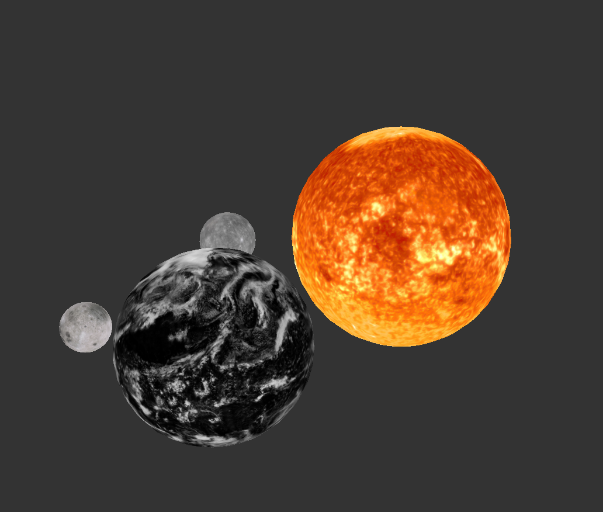
  

solar system front view(left) and upper view(right)

planet textures is from: https://github.com/1kar/OpenGL-SolarSystem/tree/master/resources/planets

#### Move at constant speed along a Bézier curve[extra feacture]

We simulate bullets moving along the trajactory. We define the relative speed by define a period that the bullet should move from the emitter to the target. At a certain time t [0, period], the bullet's position can be approximated as the point on the curve with the ratio `t/period`

  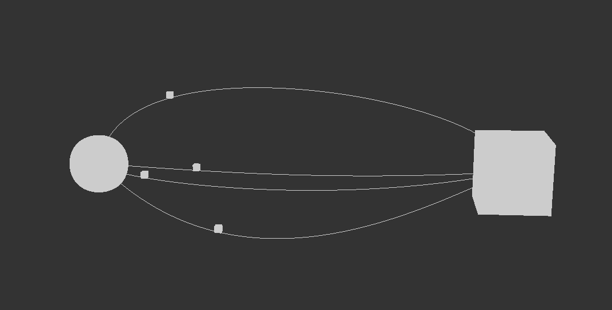
  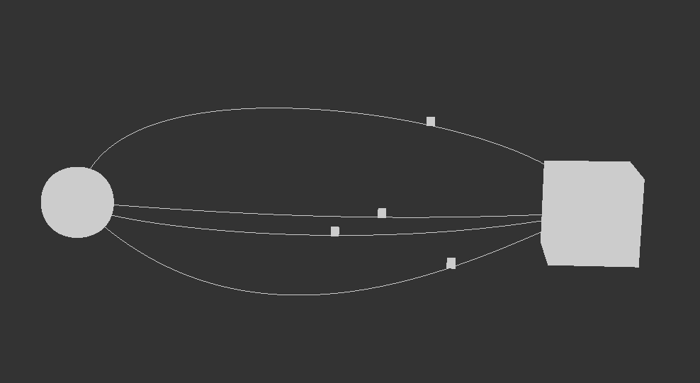

bulltes at start(left) and bullets in the end(right)

