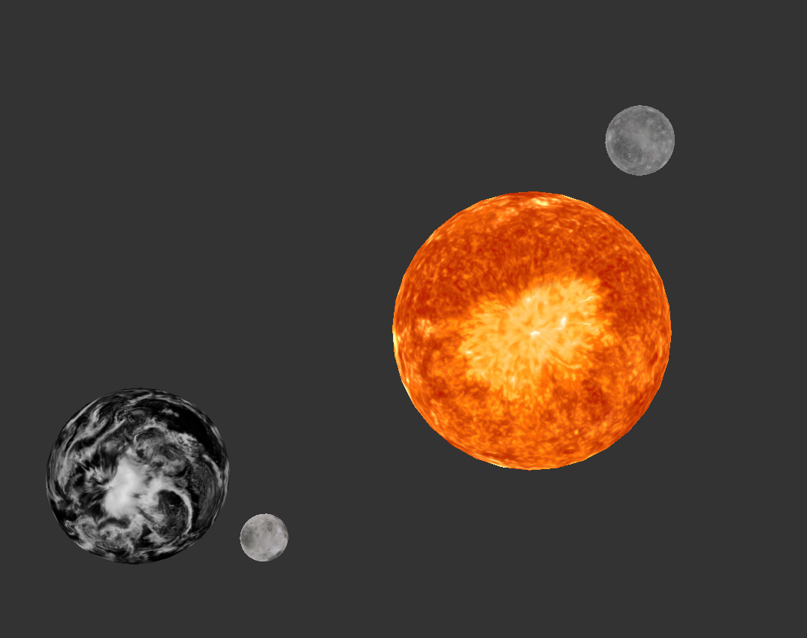

## 3DCGA Assignment 2

Group 30

#### Workload distribution

- **Renyi Yang** 5470668: Normal mapping, Environment mapping, Smooth paths, Hierarchical transformations, Move at constant speed along a Bézier curve[extra]. All 100%.
- 

#### Normal mapping

Texture and material resource is from: https://www.textures.com/download/free-3d-scanned-stone-wall-2x2-3x3-4x4-meters/133264

We load a texture that stores the normal information of each fragment, this information is in tangent space, to translate it to the world space, we calculate the tangent and the bitangent for each vertex when preprocessing the mesh. In the vertex shader, we calculate the transformation matrix as `BVN = mat3(tangent, bitangent, normal)`, in fragment shader, we get the normal in the normal texture, transform it to world space using BVN, and use this normal in phong shading. By using normal mapping the surface is more uneven and has more detail.

  
  

Texture only(left) and normal mapping(right)

#### Environment mapping

We prepare six textures in [+x, -x, +y, -y, +z, -z] axis representing the environment from all the directions.  We combine them into a `GL_TEXTURE_CUBE_MAP`. In the fragment shader, we query the texture by the opposite direction of the view direction according to the normal. By using environment mapping we simulate a reflective surface,

  
  

Environment Texture (left) and Environment mapping(right)

Environment texture is from: https://github.com/Well-Jing/3D-version-Gaunlet/tree/main/Release/skybox_darksky

#### Smooth paths

We simulate bullet trajectory using cubic Bézier curves. a Bézier curve is defined by 
$$
\mathbf{B}(t) = (1 - t)^3 \mathbf{P}_0 + 3 (1 - t)^2 t \mathbf{P}_1 + 3 (1 - t) t^2 \mathbf{P}_2 + t^3 \mathbf{P}_3, \quad 0 \leq t \leq 1.
$$
We use the bullet emitter's position as p0, and target's position as p3, p1 and p2 are randomly sampled points from the same quadrant and within the emitter and the target.

We generate 100 points according to the above equation and utilize `GL_LINE_STRIP` to draw.

  
  

3 trajectory (left) and 10 trajectory(right)

#### Hierarchical transformations

We simulate a (part of) solar system by having mercury and the Earth revolve around the Sun, the Moon revolves around the Earth, and different planets have different revolution and rotation speeds.

We store the infomation of each planet in the array, and this infomation contains the index of the orbiting object in the array (sun is -1). We do deep first search on the array and multiply current translation matrix on predecessor's matrix to obtain the final transaction. The final modelmatrix is `transation * scale(self_radius) * rotation(revolution_radius)`

  
  

solar system front view(left) and upper view(right)

planet textures is from: https://github.com/1kar/OpenGL-SolarSystem/tree/master/resources/planets

#### Move at constant speed along a Bézier curve[extra feacture]

We simulate bullets moving along the trajactory. We define the relative speed by define a period that the bullet should move from the emitter to the target. At a certain time t [0, period], the bullet's position can be approximated as the point on the curve with the ratio `t/period`

  
  

bulltes at start(left) and bullets in the end(right)
